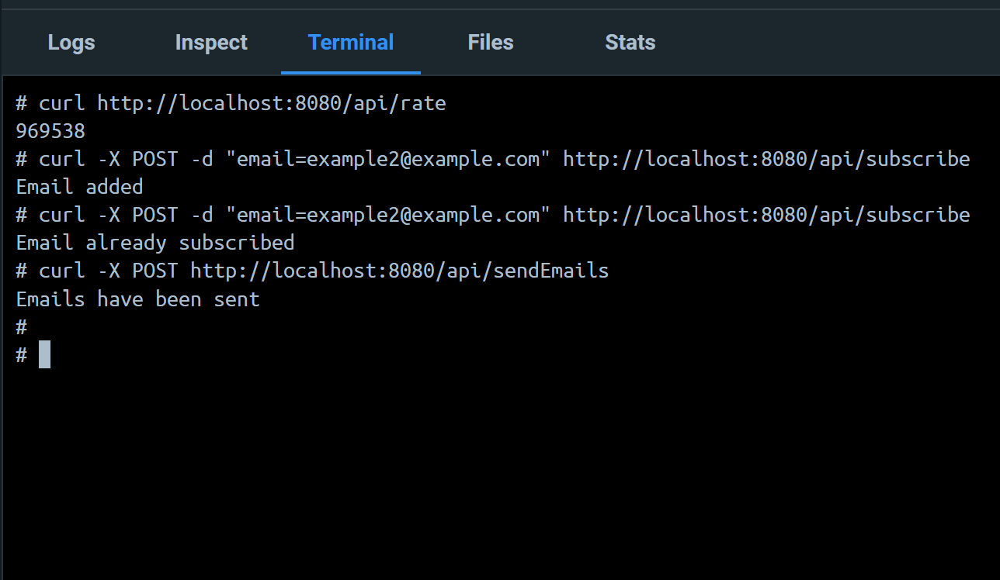

# Go-Docker-BitcoinApiService

## Table of content

&nbsp;&nbsp;&nbsp; [About Project](#about-project)\
&nbsp;&nbsp;&nbsp; [Screenshots](#screenshots)\
&nbsp;&nbsp;&nbsp; [Technologies Used](#technologies-used)\
&nbsp;&nbsp;&nbsp; [Prerequisites](#prerequisites)\
&nbsp;&nbsp;&nbsp; [Installation](#installation)\
&nbsp;&nbsp;&nbsp; [Usage](#usage)\
&nbsp;&nbsp;&nbsp; [Acknowledgments](#acknowledgments)

## About Project

This is an API service using which you can:

-   get information about current bitcoin rate (UAH)
-   subscribe your email on updates about changing bitcoin rate
-   send all the subscribed emails current bitcoin rate

Additional info:

-   Service production was guided by [this document](https://github.com/AndriiPopovych/gses/blob/main/gses2swagger.yaml).
    For convenient reading use [Swagger](https://editor.swagger.io/.)
-   All data for app is stored in json-file (don't use databases)
-   Package includes Dockerfile, so you can start system in Docker

## Screenshots

## Technologies Used

-   Go lang
-   Docker

## Prerequisites

You will need to have Go and Docker installed on your machine.

## Installation

To get started with this project, follow the steps below:

1. Clone the repository to your local machine:\
   &nbsp;&nbsp;&nbsp;&nbsp;&nbsp;&nbsp; `git clone https://github.com/yshvchnk/Go-Docker-BitcoinApiService.git`

2. Navigate to the project directory:\
   &nbsp;&nbsp;&nbsp;&nbsp;&nbsp;&nbsp; `cd Go-Docker-BitcoinApiService`

3. Input your email credentials into file `mail.go`

4. Create a Docker image:\
   &nbsp;&nbsp;&nbsp;&nbsp;&nbsp;&nbsp; `docker build -t bitcoin-app .`

5. Use commands for testing API:\
   &nbsp;&nbsp;&nbsp;&nbsp;&nbsp;&nbsp; `curl http://localhost:8080/api/rate`

    &nbsp;&nbsp;&nbsp;&nbsp;&nbsp;&nbsp; `curl -X POST -d "email=example@example.com" http://localhost:8080/api/subscribe`

    &nbsp;&nbsp;&nbsp;&nbsp;&nbsp;&nbsp; `curl -X POST http://localhost:8080/api/sendEmails`

## Usage

You can make get and post request using routes:

GET request:

-   `/api/rate` - get bitcoin rate

POST requests:

-   `/api/subscribe` - subscribe on bitcoin updates
-   `/api/sendEmails` - send emails with current bitcoin rate to all subscribers

## Acknowledgments

This project is using [CoinGecko API](https://www.coingecko.com/en/api)
